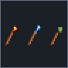

# Стихийные посохи

Качественный серверный и клиентский мод **Fabric для Minecraft 1.20.1** с тремя крафтовыми посохами. Все ключевые действия выполняются на сервере: это исключает дублирование снарядов, блоков и прочности в мультиплеере.



## Возможности

| Посох | Действие | Баланс |
| --- | --- | --- |
| 🔥 **Огненный** | Выпускает быстрый огненный снаряд в направлении взгляда. | 384 прочности, 1 ед. за выстрел, задержка 1,2 с. |
| ⚡ **Молниевый** | Призывает настоящую молнию в блок под прицелом на расстоянии до 32 блоков. | 256 прочности, 2 ед. за удар, задержка 4 с. |
| 🌿 **Земной** | Аккуратно переносит выбранный блок в соседнюю пустую клетку. | 512 прочности, 3 ед. за перенос, задержка 0,6 с. |

Посохи находятся во вкладке **«Бой»** творческого инвентаря. У каждого есть свой пиксельный спрайт, рецепт, русская и английская локализация, подсказки и визуальные/звуковые эффекты.

## Земной посох: как перемещать блоки

1. Возьмите земной посох и нажмите **ПКМ по обычному блоку**, чтобы выбрать его. Зелёные частицы подтвердят выбор.
2. Нажмите **ПКМ по грани другого блока** — выбранный блок окажется в пустой клетке с этой стороны грани.
3. Чтобы отменить старый выбор и выбрать другой источник, используйте **Shift + ПКМ** по новому блоку.

Защита от потери вещей и обхода ограничений встроена в механику:

- блок с инвентарём или другим block entity (сундук, воронка, спавнер и т. п.) не переносится;
- не переносятся бедрок, порталы, командные и структурные блоки, барьер и другие защищённые блоки;
- источник и цель проверяются сервером на права игрока, границы мира, высоту и расстояние;
- цель обязана быть пустой; сначала проверяется и размещается целевой блок, только затем очищается источник;
- источник и место назначения должны быть не дальше 24 блоков от игрока и не дальше 16 блоков друг от друга;
- сохранённый выбор сбрасывается при переходе в другое измерение или если исходный блок изменился.

## Рецепты

Расположите ингредиенты диагональю: магический компонент сверху справа, стержень в центре, палка снизу слева.

- **Огненный:** огненный заряд + стержень ифрита + палка.
- **Молниевый:** осколок аметиста + громоотвод + палка.
- **Земной:** блок мха + медный слиток + палка.

## Установка игроку

1. Установите **Fabric Loader** для Minecraft **1.20.1**.
2. Установите соответствующий **Fabric API**.
3. Скачайте `elementalstaves-1.0.0.jar` из релиза или соберите его сами.
4. Поместите JAR в папку `.minecraft/mods` и запустите игру.

Мод должен быть установлен и на сервере, и у клиентов, подключающихся к нему.

## Сборка из исходников

Требования: **JDK 17** и интернет для первого скачивания зависимостей.

```bash
./gradlew build
```

Готовый файл появится в `build/libs/elementalstaves-1.0.0.jar`. GitHub Actions также собирает JAR на каждом push и pull request.

## Технологии

- Minecraft 1.20.1
- Fabric Loader 0.15.11+
- Fabric API 0.92.2+
- Java 17

## Лицензия

[MIT](LICENSE)
