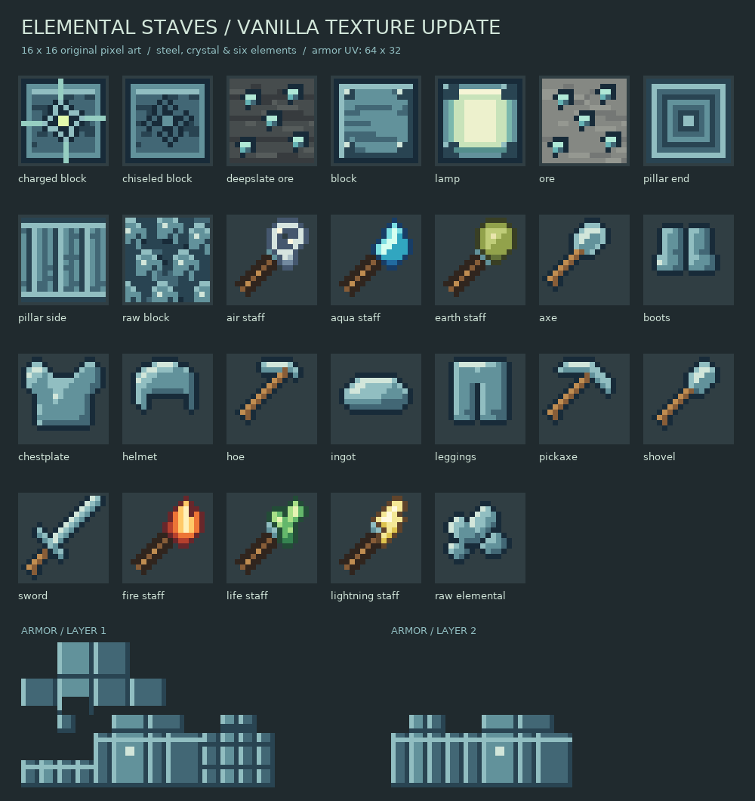

# Стихийные посохи

Клиентский и серверный мод **NeoForge для Minecraft 1.21.1**. В нём шесть крафтовых посохов, полная игровая цепочка **стихийной стали** (руда → переработка → инструменты и броня) и набор **стихийных блоков с разными механиками**: от светильников и поворотных колонн до заряженного блока, который питает ванильный маяк. Все активные способности посохов выполняются на сервере, с общей серверной обработкой урона, перезарядки и прочности.


## Интеграция Create — 1.6.0

**Create остаётся необязательным.** Поддерживается `create-1.21.1-6.0.10.jar`.
С ним двигатель и валы используют настоящую кинетическую сеть Create:
**40 об/мин, 2560 SU**, нагрузка и перегрузка, передача через его редукторы и
шестерни, внешний привод, ключ и очки инженера. Без Create работает простой привод.

Добавлена автозагрузка топлива через ItemHandler и 8 условных рецептов обработки/
конвертации валов. Ремни крепите к **штатному валу Create** — предусмотрен крафт 1:1.

[Установка, возможности, ограничения и команды проверки](docs/create-compatibility.md).
Сборка запускает отдельные серверные GameTests с Create и без него; ручная клиентская
проверка рендера/очков не заменяется этими тестами.

## Механика без магии — самостоятельный режим

Добавлены **угольный двигатель** и **приводной вал**. Это механическая передача
вращения, а не генератор электричества или магической энергии. Станков пока нет.

### Как собрать привод

1. Найдите блоки во вкладке **«Редстоун»** или скрафтите их (рецепты ниже).
2. Поставьте двигатель: сторона с медным кольцом и маховиком направлена **к вам**.
   Можно направить выход вверх/вниз, если при установке смотреть почти вертикально.
3. Поставьте вал на сторону с маховиком и продолжайте линию, нажимая на торец
   предыдущего вала. Ось X/Y/Z определяется гранью, на которую вы ставите блок.
4. Нажмите ПКМ по двигателю с **углём или древесным углём** в руке. Маховик и
   подключённые валы начнут вращаться со скоростью **40 об/мин**.
5. Поставьте рычаг рядом с двигателем: **включённый сигнал редстоуна останавливает**
   его, выключенный — разрешает работу. Оставшееся время горения на паузе сохраняется.

```text
[двигатель] → [вал] — [вал] — [вал]
             выход   одна прямая ось
```

### Топливо и управление

- Одна единица угля/древесного угля даёт **80 секунд** работы при 20 TPS.
- ПКМ углём — загрузить одну единицу; **Shift + ПКМ углём** — загрузить стопку,
  максимум **64** единицы в запасе. Смешивать два вида угля в запасе нельзя.
- ПКМ пустой рукой — статус: запас, оставшееся горение, состояние двигателя.
- **Shift + ПКМ пустой рукой** — забрать ещё не сожжённое топливо. Уже горящая
  единица не возвращается, но дорабатывает оставшееся время.
- При разрушении выпадает запас топлива; сам двигатель и валы требуют каменную
  кирку или лучше. Остаток горения при разрушении теряется.
- Топливо и остаток горения сохраняются при выходе из мира. Выгруженные чанки не
  работают и специально не подгружаются. Двигатель тратит топливо и без валов —
  выключайте его рычагом, когда он не нужен.

### Правила передачи

- Не больше **32 валов** от выходной стороны двигателя, без промежутков и поворотов.
- Неправильная ось, разрыв, обычный блок или выгруженный чанк обрывают передачу.
- Остановка/восстановление линии видны максимум через **0,5 секунды** при 20 TPS.
- Двигатели не складывают мощность: для вращения достаточно одного подходящего
  работающего двигателя с любого конца линии. Скорость всегда 40 об/мин.
- Валы не наносят урон, не производят FE и пока не приводят в действие станки.
  Воронки и ItemHandler поддерживаются с 1.6.0; отдельного окна инвентаря нет.
- Вращение рисуется отдельной моделью на клиенте; сервер определяет, работает
  ли привод. Это не просто анимированная текстура.

### Крафт без стихийных ингредиентов

**4 вала:** три железных слитка вертикально.

**Двигатель:** `Ж` — железо, `М` — медь, `П` — печь, `В` — вал:

```text
Ж Ж Ж
М П М
Ж В Ж
```

Проверки чистой логики топлива и прямой передачи запускаются через `./gradlew test`.
Ручной план проверки установки, вращения и мультиплеера —
[docs/engine-test-plan.md](docs/engine-test-plan.md).

## Обновление текстур — 1.3.1

Все 28 игровых текстур перерисованы в едином ванильном стиле: блоки и предметы
16×16, надетая броня — стандартные развёртки 64×32. Сталь получила сине-зелёную
палитру, инструменты — узнаваемые силуэты, посохи — разные навершия и цвета стихий.
Эти текстуры сохранены в версии 1.4.0; рецепты не менялись.



Для воспроизведения текстур нужен Python 3.9+ и Pillow:

```bash
python -m pip install -r tools/requirements.txt
python tools/update_textures.py
python tools/mechanical_assets.py
python tools/check_textures.py
```

## Возможности

### Посохи — мощная магия, v1.4.0

Урон указан до брони и сопротивления (2 единицы = 1 сердце).
В скобках: перезарядка / расход прочности. Оба режима делят перезарядку своего посоха.

| Посох | ПКМ | Shift + ПКМ |
| --- | --- | --- |
| **Огонь** | Три мгновенных луча до 22 блоков: 10 урона и горение 5 с. Каждый моб получает урон лишь раз за залп. (0,6 с / 2) | Кольцо огня вокруг игрока, радиус 7: 14 урона, горение 6 с и отбрасывание. (2,5 с / 6) |
| **Молния** | Наведитесь на моба до 32 блоков: цепь до 5 целей, прыжки до 6 блоков, урон 12 → 8. (1,2 с / 3) | Гроза вокруг моба в прицеле, радиус 7: 16 урона. (3,5 с / 8) |
| **Земля** | В воздух: ударная волна радиусом 7, 12 урона, подбрасывание и замедление II на 3 с. (1,5 с / 3) По блоку: прежний выбор/перенос. (0,6 с / 3 за перенос) | В воздух: сопротивление II и поглощение II на 8 с. (5 с / 5) По блоку: смена выбранного источника. |
| **Вода** | По блоку: тушение в кубе с радиусом 4 и источник воды рядом с гранью. Вода не ставится в Незере. (1,5 с / 2) | Ледяная волна конусом вперёд до 10 блоков: 8 урона, замедление IV на 5 с, тушение и отбрасывание. (1,75 с / 3) |
| **Ветер** | Конус вперёд до 7 блоков: 6 урона, сильное отбрасывание от игрока и плавное падение на 8 с. (1 с / 2) | Рывок в направлении взгляда с подъёмом и плавным падением на 10 с. Без телепортации сквозь стены; недоступен верхом и при полёте на элитрах. (2 с / 3) |
| **Жизнь** | Восстанавливает 12 HP себе или существу при прямом нажатии, снимает вредные эффекты и горение. После лечения — регенерация II на 5 с. (1,5 с / 4) | Лечит игроков и своих приручаемых питомцев в радиусе 8 блоков с теми же эффектами. (4 с / 8 за всю группу) |

**Безопасность и ограничения:**
- Боевая магия поражает мобов, но не игроков, жителей, приручённых питомцев/лошадей и союзников по команде. Обычные животные без хозяина могут быть задеты.
- Массовые атаки требуют видимости от игрока, цепная молния — также между целями. До 24 мобов за массовый удар.
- Огонь и молния больше не создают ванильные снаряды/молнии: нет поджога блоков и превращения криперов. Горят только поражённые существа.
- Неудачная попытка без цели/лечебного эффекта не тратит прочность. Исключение: огненный залп расходуется и при промахе. Защитная кожа и рывок расходуются при каждом успешном применении.
- Эффекты, урон, прочность и перезарядка рассчитываются сервером. В творческом режиме прочность не тратится.
- Совместимость с защитой территорий сторонних модов отдельно не проверена; это не полноценная интеграция с приватами.

### Стихийная сталь

- **Стихийная руда** и её глубинносланцевый вариант появляются только в **новых чанках Верхнего мира**: до 4 жил размером до 5 блоков на чанк, между Y = −32 и Y = 48.
- Для добычи нужна как минимум **железная кирка**. Руда даёт необработанный стихийный кристалл; «Удача» увеличивает количество.
- Переплавьте кристалл в печи или плавильной печи, чтобы получить **слиток стихийной стали**. Девять слитков собираются в декоративный блок и обратно.
- Из слитков крафтятся меч, кирка, топор, лопата, мотыга и полный комплект брони. Рецепты используют привычные ванильные схемы.
- Инструменты имеют 900 прочности, скорость добычи 7 и добывают блоки алмазного уровня. Броня даёт 17 единиц защиты, 1 единицу твёрдости и имеет прочность 275 / 400 / 375 / 325 (шлем / нагрудник / поножи / ботинки).
- Слиток служит ингредиентом ремонта для всех стихийных инструментов и брони. Комплект добавлен в творческие вкладки, поддерживает соответствующие зачарования; броню также можно украшать кузнечными шаблонами.

### Новые блоки и механики (v1.3)

Пять новых блоков продолжают стиль стихийной стали и дают новые игровые механики:

| Блок | Механика | Крафт |
| --- | --- | --- |
| 🧱 **Блок необработанного стихийного кристалла** | Компактное хранение: 9 кристаллов ⇄ 1 блок (как блоки сырой руды). | 3×3 необработанных кристалла; обратно — 9 кристаллов. |
| 💡 **Стихийный светильник** | Источник света **15 уровня**, как морской фонарь; не требует инструмента. | 4 слитка по углам + светокамень в центре. |
| 🏛 **Стихийная колонна** | Поворачивается по любой оси (X/Y/Z), как кварцевая колонна, — удобно для декора. | 2 блока стихийной стали вертикально. |
| 🔷 **Резной блок стихийной стали** | Декоративный блок с гравировкой. | 2 блока стихийной стали горизонтально. |
| ⚡ **Заряженный блок стихийной стали** | Работает как **основа маяка** и слабо светится (уровень 7). Добывается только железной киркой. | 8 слитков вокруг блока стихийной стали. |

Интеграция с ванильными механиками через теги:

- **Заряженный блок** добавлен в тег `minecraft:beacon_base_blocks` — из него можно строить пирамиды под маяком.
- **Слиток стихийной стали** добавлен в тег `minecraft:beacon_payment_items` — маяк принимает его как платёжный предмет, как железо, золото или алмазы.

У всех новых блоков есть собственные пиксельные текстуры, модели, русская и английская локализация, таблицы добычи, рецепты и разблокировки книги рецептов. Все новые блоки лежат во вкладке **«Строительные блоки»**, посохи — во вкладке **«Бой»**.

## Как пользоваться посохами

### Земной посох: как перемещать блоки

1. Возьмите земной посох и нажмите **ПКМ по обычному блоку**, чтобы выбрать его. Зелёные частицы подтвердят выбор.
2. Нажмите **ПКМ по грани другого блока** — выбранный блок окажется в пустой клетке с этой стороны грани.
3. Чтобы отменить старый выбор и выбрать другой источник, используйте **Shift + ПКМ** по новому блоку.

Защита от потери вещей и обхода ограничений встроена в механику:

- блок с инвентарём или другим block entity (сундук, воронка, спавнер и т. п.) не переносится;
- не переносятся бедрок, порталы, командные и структурные блоки, барьер и другие защищённые блоки;
- источник и цель проверяются сервером на права игрока, границы мира, высоту и расстояние;
- цель обязана быть пустой; сначала проверяется и размещается целевой блок, только затем очищается источник;
- источник и место назначения должны быть не дальше 24 блоков от игрока и не дальше 16 блоков друг от друга;
- сохранённый выбор сбрасывается при переходе в другое измерение или если исходный блок изменился.

### Водный посох

Нажмите **ПКМ по блоку**: посох потушит огонь в радиусе 4 блоков (включая горящих существ) и, если клетка рядом с гранью пустая, зальёт её источником воды. Блоки и место проверяются сервером на права игрока и дальность.

### Боевые и дополнительные режимы

См. таблицу выше. Для земного посоха смотрите **в воздух**, чтобы использовать волну
или каменную кожу, не меняя выбранный блок. Для молнии наведитесь именно на моба,
а не на землю. Водная ледяная волна работает через Shift + ПКМ и в воздух, и по блоку.
Для остальных боевых посохов удобнее целиться в мобов/воздух: интерактивные блоки
(сундуки, двери) могут перехватывать обычный ПКМ по правилам Minecraft.

## Рецепты посохов

Расположите ингредиенты диагональю: магический компонент сверху справа, стержень в центре, палка снизу слева.

- **Огненный:** огненный заряд + стержень ифрита + палка.
- **Молниевый:** осколок аметиста + громоотвод + палка.
- **Земной:** блок мха + медный слиток + палка.
- **Водный:** призмариновые кристаллы + медный слиток + палка.
- **Посох ветра:** заряд ветра + перо + палка.
- **Посох жизни:** золотое яблоко + слеза гаста + палка.

## Установка игроку

1. Установите **NeoForge 21.1.248 или новее** для Minecraft **1.21.1**.
2. Скачайте ZIP-артефакт успешной сборки из [Actions](https://github.com/vvdd7232-lang/mod-minecraft/actions), распакуйте JAR или соберите ветку сами.
3. Поместите JAR в папку `.minecraft/mods` и запустите игру.

Мод должен быть установлен и на сервере, и у клиентов, подключающихся к нему. Новая руда появляется только в чанках, созданных после установки мода.

## Сборка из исходников

Требуются **JDK 21** и интернет для первого скачивания зависимостей.

```bash
./gradlew build
```

Готовый файл появится в `build/libs/elementalstaves-1.6.0.jar`.

## Технологии

- Minecraft 1.21.1
- NeoForge 21.1.248+
- Java 21

## Лицензия

[MIT](LICENSE)
